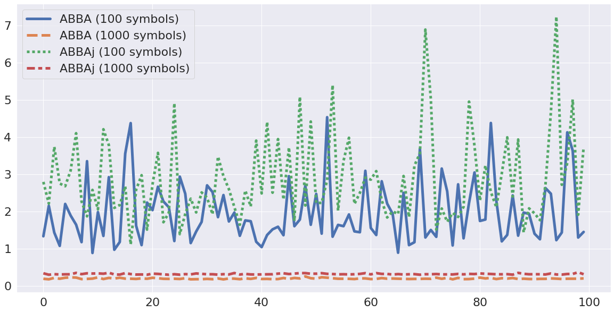

# ABBAj

[](https://app.travis-ci.com/github/nla-group/ABBAj.jl)
[](https://github.com/nla-group/ABBAj.jl/actions)
[](https://codecov.io/gh/nla-group/ABBAj.jl)
[](https://opensource.org/licenses/BSD-3-Clause)
[](https://mybinder.org/v2/gh/nla-group/jlABBA/HEAD)
[](https://doi.org/10.5281/zenodo.6286546)

A Julia version of ABBA with parallel k-means implementation 
> + Documentation: [](https://nla-group.github.io/ABBAj.jl/dev/)

ABBA (Adaptive Brownian bridge-based aggregation) is a symbolic time series representation method introduced by Elsworth Steven and Stefan Güttel, which archives time-series compression and discretization by transforming time series into a symbolic representation. Compared to raw data, symbolic representation enjoys numerous benefits including dimensionality reduction, noises reduction, features discretization, and so on. The software `fABBA` (https://github.com/nla-group/fABBA) already provided ABBA transformation with appealing speed and tolerance-oriented digitization. Now our application of interest focus on that is it possible to accelerate ABBA by preserving k-means clustering? The package provides lightweight Julia implementation of the ABBA method, using ParallelKMeans.jl to achieve speedup in the digitization. 

`ABBAj` is a Julia module for time series transformation with ABBA. With `ABBAj`, you can employ ABBA in an efficient way to symbolize time series and applied the symbolic representation to the downstream time series task such as classification and forecasting. Compared to the ABBA module, `ABBAj` enjoys significantly faster speed while retaining the consistent reconstruction error of representation.  


## Installation
You can simply install the stable version of this package by running in Julia:

```julia
pkg> add ABBAj
```


## Examples

```julia
julia> time_series = load_sample(); # load time series samples 
julia> symbols, model = fit_transform(time_series, 4, 0.1); # use 4 symbols with compressed tolerance of 0.1
julia> r_time_series = inverse_transform(symbols, model, time_series[1]); # inverse transform time series
```

The reconstruction is shown below.


## Julia ABBA VS Python ABBA
We run `ABBAj` and Python ABBA in 100 random samples and each sample with 5000 noises generated from normal distribution by specifying the number of symbols at 100, 1000, respectively. 

The comparison of root-mean-square deviation :



The comparison of runtime:


The two figures shown in above demonstrate that by using Julia, `ABBAj` runs much faster than ABBA while the reconstruction accuracy is preserved. The difference results from the k-means implementation.


### Referece
Elsworth, S., Güttel, S. ABBA: adaptive Brownian bridge-based symbolic aggregation of time series. Data Min Knowl Disc 34, 1175–1200 (2020). https://doi.org/10.1007/s10618-020-00689-6
